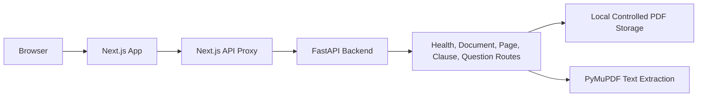

# LegalLens AI

LegalLens AI is a full-stack MVP foundation for source-grounded legal assistance over employment contracts and offer letters. This version includes PDF upload, validation, page-aware text extraction with PyMuPDF, structural clause detection, and evidence-preserving chunking.

Retrieval, vector search, database storage, authentication, OCR, and LLM answering are intentionally left for later phases.

## Architecture



The browser calls local Next.js API routes such as `/api/health`. Those routes call FastAPI using the server-side `BACKEND_API_URL` environment variable. This keeps backend configuration and future API keys out of frontend browser code.

## Folder Structure

```txt
legallens-ai/
  apps/
    web/
      app/
      components/
      lib/
  services/
    api/
      app/
        main.py
        config.py
        routes/
        domain/
        services/
        db/
        tests/
```

## Local Development

From `D:\LawAi`:

```powershell
Copy-Item .env.example services\api\.env
Copy-Item .env.example apps\web\.env.local
```

### Backend

```powershell
cd D:\LawAi\services\api
python -m venv .venv
.\.venv\Scripts\Activate.ps1
python -m pip install --upgrade pip
python -m pip install -r requirements.txt
python -m uvicorn app.main:app --reload --host 127.0.0.1 --port 8000
```

Health check:

```powershell
Invoke-RestMethod http://127.0.0.1:8000/health
```

### Frontend

Open a second PowerShell window:

```powershell
cd D:\LawAi\apps\web
npm install --no-package-lock
npm run dev
```

Open `http://localhost:3000`.

## Production Deployment

### 1. Environment Variables
You must set these environment variables in your production hosting environments (e.g. EC2, VPS, Vercel, Render). Do not commit `.env` files with secrets.

**Backend (`services/api`):**
- `GEMINI_API_KEY`: Your Gemini API secret key.
- `APP_ENV`: `production`
- `CORS_ORIGINS`: e.g. `https://your-frontend-domain.com`

**Frontend (`apps/web`):**
- `BACKEND_API_URL`: e.g. `https://api.your-domain.com`

### 2. Backend Start Command
Use a production WSGI/ASGI server runner:
```bash
cd services/api
python -m uvicorn app.main:app --host 0.0.0.0 --port 8000
```

### 3. Frontend Build & Start
```bash
cd apps/web
npm run build
npm start
```

## Current API

- `GET /health`: Health and readiness check.
- `POST /documents`: multipart PDF upload and validation
- `POST /documents/{documentId}/process`: Extract text and clauses
- `GET /documents/{documentId}`: Check document status
- `GET /documents/{documentId}/pages`: Retrieve all pages
- `GET /documents/{documentId}/pages/{pageNumber}`: Retrieve a specific page
- `GET /documents/{documentId}/clauses`: Retrieve all detected clauses
- `GET /documents/{documentId}/chunks`: Retrieve chunked evidence
- `POST /documents/{documentId}/questions`: Ask a question (Returns citations and ambiguities)
- `DELETE /documents/{documentId}`: Safely delete the document from disk

## Limitations & Risks (IMPORTANT)

- **Local Filesystem Persistence:** Uploaded PDFs are stored in `services/api/storage/documents`. This relies on local disk. If you deploy to an ephemeral serverless container (e.g., Heroku without volumes, Render free tier, Vercel), uploaded documents will be lost upon restart. **Mitigation for Scale:** Transition to S3-compatible object storage.
- **OCR Limitations:** Empty or low-text pages are marked as scanned-like. OCR is not yet supported.
- **Keyword Retrieval Limitations:** Currently relies on exact and stemmed keyword retrieval. Complex semantic queries might require vector-based retrieval in the future.
- **Rate Limiting:** No rate limiters are configured, meaning abuse of the PDF upload or LLM endpoints could exhaust external API quotas.

## Tests

Backend tests:

```powershell
cd D:\LawAi\services\api
.\.venv\Scripts\Activate.ps1
python -m pytest
```

Expected result:

```txt
37 passed
```
